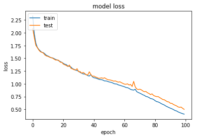
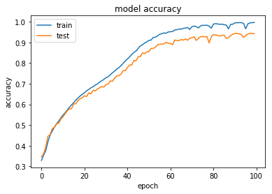
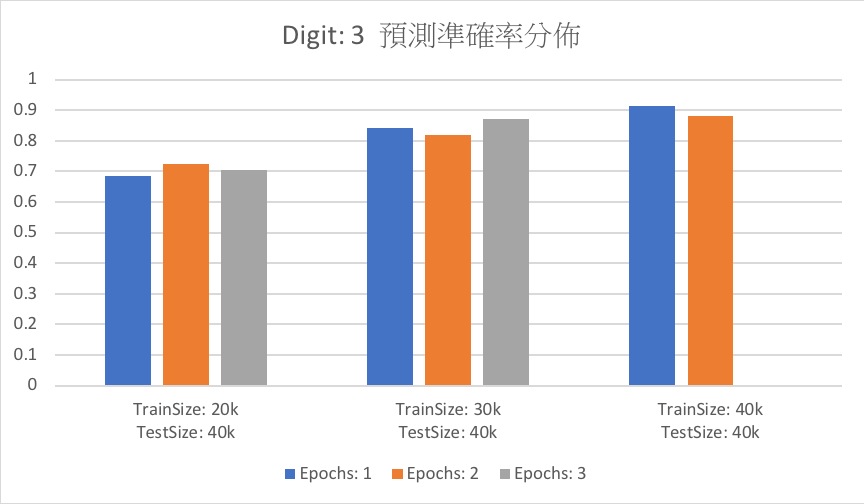

# Adder and Subtractor_rnn
An implementation of sequence to sequence learning for performing 3 digits addition and subtraction
## Excution
`python model.py`
## Coding Parts
### Program logic
* Combine adder and subtractor
* Most part of program are just like sample code
* Sorted at data generation part, make sure that no identical pairs of training data and A >= B
* Select appropriate training parameter, including iterates, epochs, training size

### Result
在二位數以及三位數的加減法器中皆選擇了三種不同的training size，再分別以不同的epochs去training。所有iterate皆為100次

#### Digit 2
| accuracy | loss |
| ---- | ---- |
|  |  |
| Test data預測準確率 | Test data預測所需時間 |
| - | - |
|  |  | 
#### Digit 3
| accuracy | loss |
| ---- | ---- |
|  |  |
| Test data預測準確率 | Test data預測所需時間 |
| - | - |
|  |  |

## Report Part
### Q1: Analysis the results under different number of digits, training epoch, training size, etc
A:
1. Training Size:
就training size來看，很明顯的可以看出，training size越大，則預測的準確率則越高，同時所需的時間也同時線性成長。
2. Digits:
如果就以所有A,B(A>=B)的組合來講，兩位數就只有5050種，加上考慮加號以及減號也就10k出頭的組合，這樣一來最直接的就是只要training size越接近這個數字，準確率就會越高。同時間理所當然的花費時間也是往上成長。
雖然整體趨勢大體上相同，但值得討論的是當二位數需要花費6k/10k來作為training size時才能夠達到約90%的準確率時，三位數只要40k/1000k 作為training size就可以達到90%的準確率。我想會有這樣的情形是來自於這是單純的加減法，而加減法有一個很規律的規則，那就是都可以看成一個位數加/減上一個位數的運算，只是要注意補位的情況，而這樣看來training size再往上提所能造成的效果也比較難往上了，因為model已經很好的學習到了這個規律了。
3. Epochs:
一個epoch指代所有的數據送入網路中完成一次前向計算及反向傳播的過程。而在兩位數的時候可以看到，隨著epoch的上升，準確率也有些微的提升。但在三位數時準確率卻有時反倒會下降，這應該是由於權重迭代的次數增多，導致model underfitting所造成的，而在這次的加減法器中，由於數據集的多樣化程度較低，選擇較低的epochs應該就夠了。

###  Q2: Can we apply the same training approach for multipliction?
A: 方法上是可行的，但是由於乘法不如加/減法一般，答案分佈範圍較小且分佈為連續性的。乘法的稀疏分佈讓model很難短時間train的精準，實際去測試後，不論參數如何去調整，其準確率依舊不會高到哪裡去(0.2左右)，因此我覺得這個方法並不適合乘法。